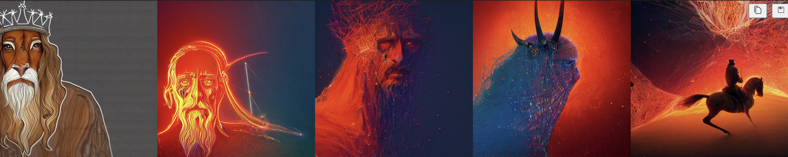
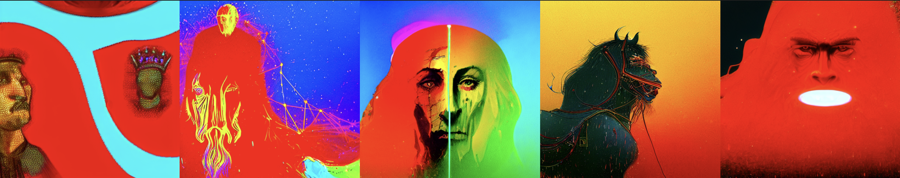

# Genrative Art and Stable Diffusion

## Objective:
The purpose of this repository is to understand the architecture of Generative Art & Stable Diffusion

## Repository:
```
.
├── LICENSE
├── README.md
├── config.py
├── diffusion_loss.py
├── image_generator.py
├── inference.ipynb
├── model.py
├── prediction.py
├── requirements.txt
├── symmetry_loss_analysis.py
└── utils.py
```

## How to execute this repository?

In `inference.ipynb`, 
    - add the prompt in the `prompt` variable
    - configure the required loss function and execute the prediction function

## Results

`prompt = A King riding a horse`

### 1. Without Loss Function


### 2. Blue Channel

Computing the average absolute difference between the `blue channel` values of each pixel in the batch and the target value of `0.9`. This allows us to measure how far, on average the blue channel deviates from the desired value of `0.9` across all images in the batch


### 3. Elastic Deformations

A data augmentation process. Applying the random elastic deformations to get an input image. The Strength and Smoothness of these deformations are controlled by the `alpha` and `sigma` parameters. The process involves generating displacement vectors for each pixel, adding these vectors to an identified grid, and then using the deformed grid to interpolate pixel values from the original image.



### 4. Saturation

Applied a saturation adjustment to the images, and the error is calculated as the mean absolute pixel-wise difference between the original and the transformed images


